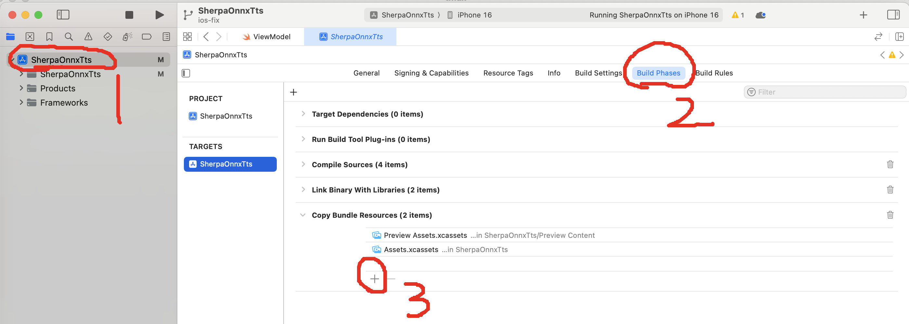
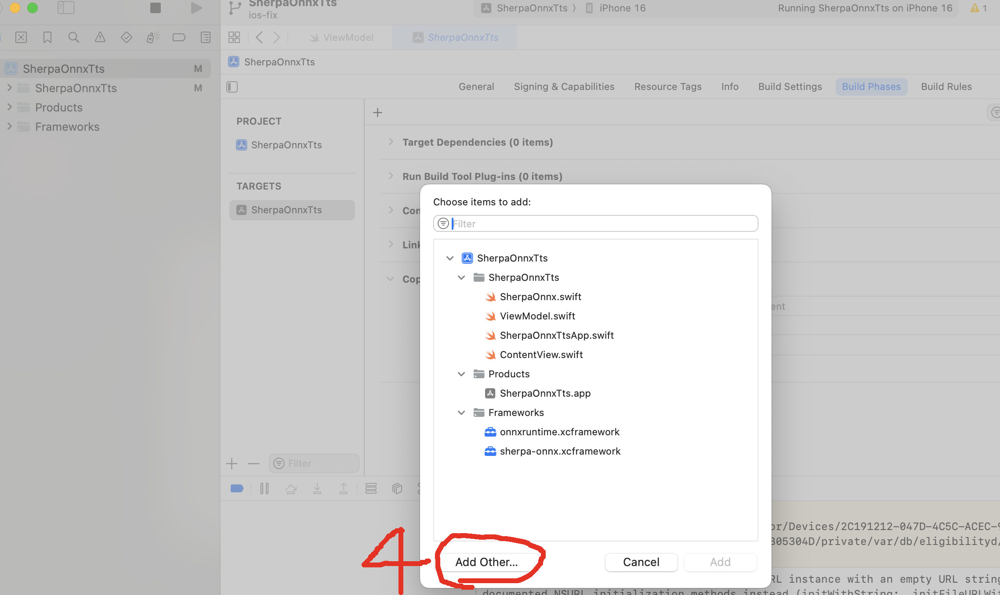
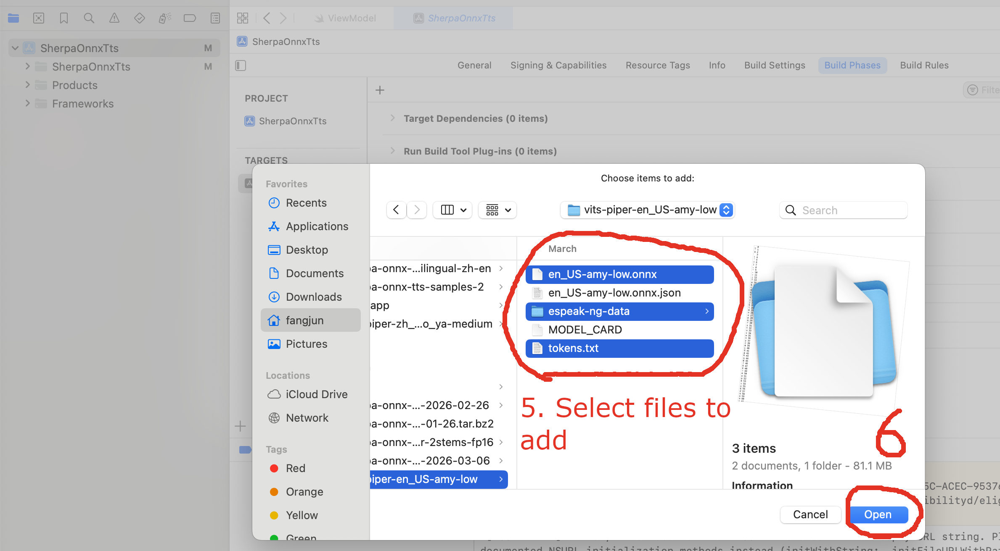
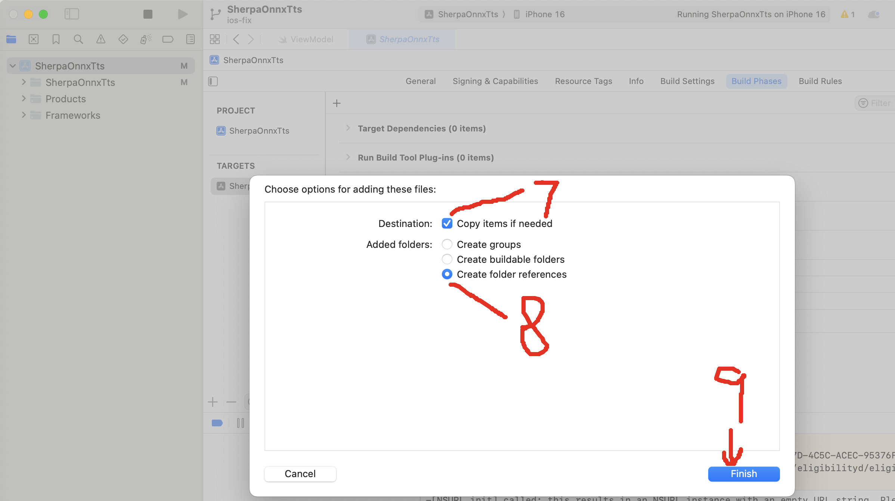

SherpaOnnxTts.app/espeak-ng-data/phontab' does not exist. Please check --vits-data-dir
=======================================================================================

If you are running the ios TTS demo and get errors like::

  /Users/fangjun/open-source/sherpa-onnx/sherpa-onnx/csrc/offline-tts-vits-model-config.cc:Validate:56 '/Users/fangjun/Library/Developer/CoreSimulator/Devices/2C191212-047D-4C5C-ACEC-95376FD33988/data/Containers/Bundle/Application/18FAC889-55E2-4D52-BD7F-FEB8A9B86941/SherpaOnnxTts.app/espeak-ng-data/phontab' does not exist.
  Please check --vits-data-dir

Please do the following 9 steps to add model files to your XCode project.

.. hint::

   See also `<https://github.com/k2-fsa/sherpa-onnx/pull/1737>`_.

